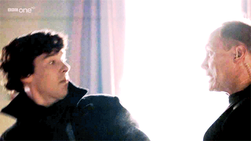

# welcome to my account!
⊱ luci/mari • infj • sharing NG 🚫 夢女子 • artist/writer • canon x oc enjoyer • multifandom • rareshipper • c + h OK

 ◇:*:◆:*:◇:*:◆

 "Hi, everypony!! I'm Mari and it seems like you have stopped by and checked my github account if you saw me on Ponytown roaming around or just chilling so I shall be introducing myself. 

I'm an artist/writer and is a college graduate of Digital Graphics and Animation. I tend to procastinate alot sadly but I do try my best to draw and write some things as well. 

My content is most entirely canon x oc and if you've got a problem with it and hate it, you are not welcome in my account but if you do love canon x oc like me, I would totally hype you up and support you if you have one however there's some limits and I shall be explaining it here as well.

I'm very introverted so I tend to not usually interact with anyone unless I know you. Complimenting my skins is a-okay to me and I can also reply to it when I can.

 ◇:*:◆:*:◇:*:◆
  

 𝐁𝐄𝐅𝐎𝐑𝐄 𝐈𝐍𝐓𝐄𝐑𝐀𝐂𝐓𝐈𝐍𝐆 𝐖𝐈𝐓𝐇 𝐌𝐄 𝐎𝐍 𝐏𝐎𝐍𝐘𝐓𝐎𝐖𝐍, 𝐈 𝐇𝐀𝐕𝐄 𝐀 𝐅𝐄𝐖 𝐓𝐇𝐈𝐍𝐆𝐒 𝐓𝐎 𝐑𝐄𝐂𝐎𝐍𝐒𝐈𝐃𝐄𝐑 𝐖𝐈𝐓𝐇 𝐘𝐎𝐔 𝐆𝐔𝐘𝐒

.•*•.•*•.•*•.•*•.•*•.•*•.

◇ Strictly do not steal or copy my skins or style cause I created all of my skins myself unless I put that it's a tut skin on the name or I gave you permission to do my style. Inspo is okay as long as you ask me.

◇ I'm pretty sensitive so please make sure to interact with extreme caution to me.

◇ I don't roleplay so please do not rp with me out of nowhere unless you are a friend of mine and I will have "SYS" or "RPDNI" on my ponies most entirely meaning, I don't wanna engage in a roleplay with you.

◇ I tend to have anxiety attacks out of nowhere and I usually put "DNIUP", "IWEC", "DNIUF" if I do get some scenarios. 

◇ If I have "AFK" on my name that means I'm away from my phone and is busy irl or doing something else. When I have "SEMI-AFK" my replies tends to be late.

◇ Trey Clover from Twisted Wonderland and Sherlock Holmes (BBC Version) are both my comfort characters and I'm a non-sharing yumejoshi to them meaning, I feel very uncomfortable and I will never consider interacting with you at all if you also have a romantic oc ship with them. I do respect your oc ship but please do not interact with me or talk about your oc ship to them with me for my sake and do respect my boundaries that's all I ask for and nothing elese.

◇ I will NOT TOLERATE HARASSMENT towards me or my friends and if you are trying to harass me or my friends, I'll block you immediately.

◇ Do not interact with me if you are proshipper and just leave me alone.

◇ I am a rareshipper and I prefer it more than popular ships. I also have canon x canon ships that I love so please respect my ships for I respect yours as well.

 ◇:*:◆:*:◇:*:◆
  

𝐇𝐄𝐑𝐄 𝐀𝐑𝐄 𝐒𝐎𝐌𝐄 𝐅𝐀𝐍𝐃𝐎𝐌𝐒 𝐓𝐇𝐀𝐓 𝐈'𝐌 𝐈𝐍 (If the text is red, that means it's my most hyperfixated fandom)
  

◇ $${\color{red}Sherlock \space \color{red}(BBC)}$$ 

◇ $${\color{red}Twisted \space \color{red}Wonderland}$$ 

◇ $${\color{red}Marvel \space \color{red}(MCU)}$$   

◇ $${\color{red}Attack \space \color{red}On\space\color{red}Titan}$$

◇ $${\color{white}Epic \space \color{white}The\space\color{white}Musical}$$

◇ $${\color{white}Naruto}$$
